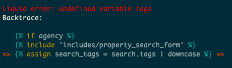

# LiquidDebug

## Overview

_LiquidDebug_ provides a stack trace of executed [_Liquid_](https://shopify.github.io/liquid/) code when an error occurs, supplementing the [typically vague] default error format provided by _Liquid_.

It is _not_ suitable for a production environment as it makes no effort to account for performance or memory leak issues and so should only be used in a development environment when debugging specific issues.

## Installation

Add the following to your `Gemfile`:

```
gem 'liquid_debug', '~> 0.1.1'
```

## Usage

Include the _LiquidDebug_ extension (e.g. in an initializer or in `config/application.rb`):

```
# config/initializers/liquid_debug.rb
require 'liquid/debug' if Rails.env.development?
```

You should now see something like this in your server output when a _Liquid_ error occurs:


